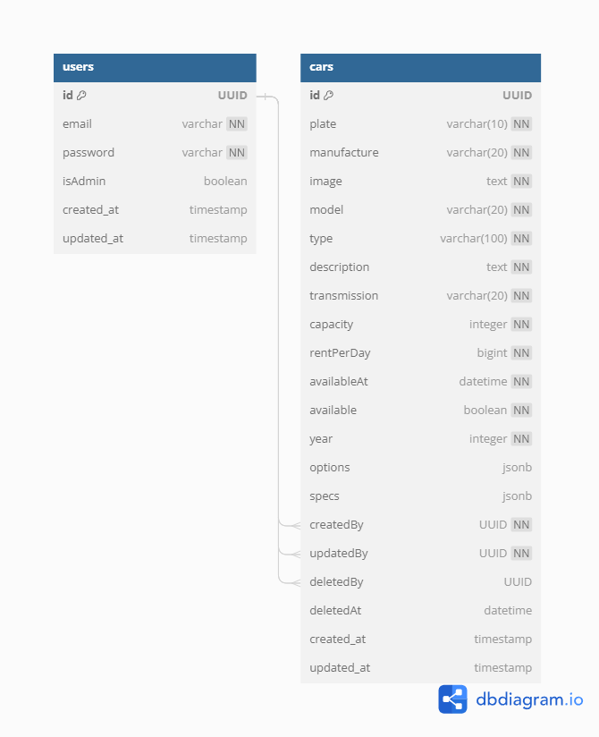

# Binar Car Rental

## Guide to Run 
* `npm i` to install all the dependencies
* Don't forget to make your own `.env` based on `example.env`
* When its finish:
    * `npm run build:watch` to compile all these typescript things
    * `npm run dev` to run the server ⚡

## About Migrations and Seeds
* `knex migrate:latest` to run the migration's file
* `knex seed:run` to fill data on database

## Entity Relationship Diagram

For now only one table is available:  
  

## Endpoints

### Frontend
 URI | Description | 
 --- | ----------- |
`/`     | index (landing page) |
`/cars` | Find Available Car |

### Backend
Method | URI | Description | 
------ | --- | ----------- |
**GET** | `/api/v1/cars/` | Display all cars data from database |
**GET** | `/api/v1/cars/:id` | Display specific car data from database by ID |
**POST** | `/api/v1/cars/` | Create car data to database |
**UPDATE** | `/api/v1/cars/:id` | Update specific car data from database by ID |
**DELETE** | `/api/v1/cars/:id` | Delete specific car data from database by ID |

### Documentations
 URI | Description | 
 --- | ----------- |
 `/docs` | Documentation with Swagger OpenAPI |

 

> If you want to try and input data or update data, you can use data from [this](https://github.com/pockypoem/car-management-dashboard/blob/main/src/data/cars.json)

## Tech Stack
* Frontend
    * HTML
    * CSS
    * Javascript
    * Bootstrap
* Backend
    * typescript
    * nodejs, expressjs
* Database
    * postgre SQL